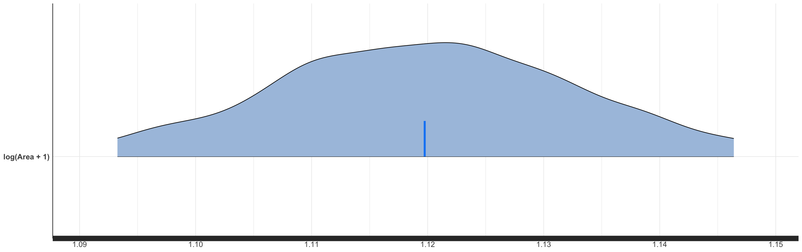
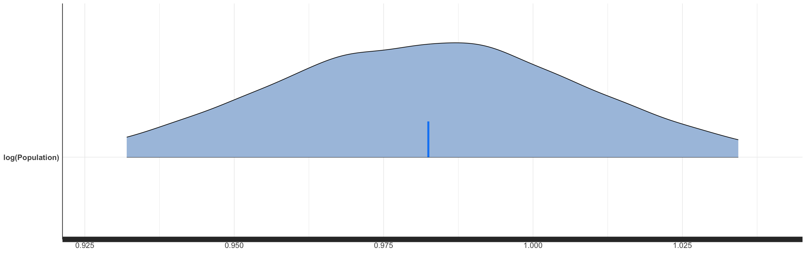
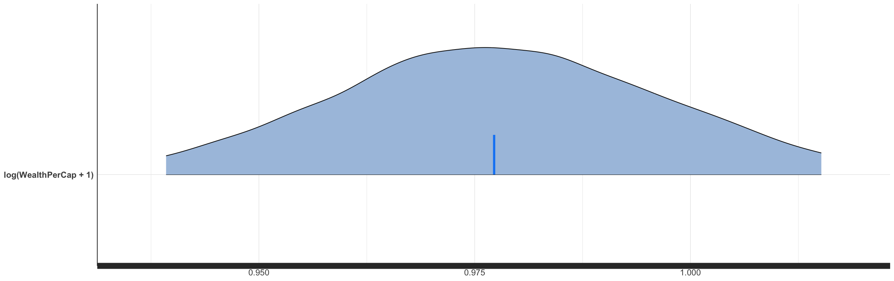

```{r setup, include=FALSE}
knitr::opts_chunk$set(echo = TRUE)
```

# Team 25 Project

If running the notebook for the first time, uncomment the the first line to install required package.

```{r Library, results='hide'}
# install.packages(c("rstanarm","bayesplot", "ggplot2", "broom", "caret", "shinystan", "MASS", "car"))
library(MASS)
library(caret)
library(rstanarm)
library(bayesplot)
library(ggplot2)
library(broom)
library(shinystan)
library(car)

```

### Load and clean data
Once the data is loaded and cleaned, the sata set is then split into a training data set and test data set
```{r Data, echo=FALSE}
DataPath <- "../Data/HurricaneData.csv"
Data <- read.csv(DataPath)

set.seed(0)
KeepCols <- c("Damage", "Area", "WindSpeed", "Pressure", "WealthPerCap", "Population", "Decade")
HurricaneData <- Data[, KeepCols]
HurricaneData$Decade <- as.factor(HurricaneData$Decade)

Split <- createDataPartition(HurricaneData$Decade, p = .7, list = FALSE)
TrainData <- HurricaneData[Split, ]
TestData <- HurricaneData[-Split, ]

head(HurricaneData)
```

## OLS Regression Model

### Build Model
Build a Multiple Linear Regression model using the training data set
```{r OLS Build Model}
RegModel_01 <- lm(Damage~Area+WindSpeed+WealthPerCap+Population, data=TrainData)
summary(RegModel_01)
```
The Multiple Linear Regression model has an r-squared of 39% but not all variables are statistically significant at a 95% confidence interval. The resulting r-squared is surprisingly low so we will have to investigate why this is.

### Check Model Assumptions
```{r OLS Assumptions}
plot(RegModel_01)
```
Just looking at the brief summary of the resulting model shows that there is something wrong with the relationship between the predictor variables and the response variable. 

### Check that chosen predictor variables do not show Multicollinearity
```{r OLS Assumptions}
vif(RegModel_01)
```
The variance Inflation Factors (VIF) are all below 5 which shows that the predictor variables do not show collinearity against each other. 

### Check that error term has a constant variance 
```{r OLS Assumptions}
plot(residuals(RegModel_01) ~ fitted(RegModel_01))
grid()
abline(h=0, col="blue")
lines(stats::lowess(residuals(RegModel_01) ~ fitted(RegModel_01)), col="red")
```
Error terms appear to be non-constant and thus observe heteroscedasticity. AS a result, we might need to perform a log transformation in our response variable. 

### Transforming the response variable (Damage)
Response variable "Damage" is log transformed and data is again split into a training data set and test data set
```{r OLS Log Transform}
set.seed(0)
HurricaneData$LogDamage <- log(HurricaneData$Damage+1)
HurricaneData <- HurricaneData[names(HurricaneData) != "Damage"]

Split <- createDataPartition(HurricaneData$Decade, p = .7, list = FALSE)
TrainData <- HurricaneData[Split, ]
TestData <- HurricaneData[-Split, ]

head(HurricaneData)
```

### Build Model 02
Build a second model with the log transformed response variable
```{r OLS}
RegModel_02 <- lm(LogDamage~Area+WindSpeed+WealthPerCap+Population, data=TrainData)
summary(RegModel_02)
```
The Multiple Linear Regression model has an r-squared of 57% while having all predictor variables being statistically significant at a 95% confidence interval. This proves the predictor variables can explain 57% of the variance in the response variable (Damage) which is a significant improvement from the previous model.

### Check Model Assumptions
Before deciding whether the model built will give the best estimations, we have to check the model against some ordinary least squares (OLS) assumptions. 
```{r OLS Assumptions}
plot(RegModel_02)
```
Just looking at the brief summary of the second model, we can see that it is performing a lot better than the first model built. 

### Check that Residuals are Normally Distributed
```{r OLS Assumptions}
qqPlot(residuals(RegModel_02))
```
Residuals show to be normally distributed

### Check that chosen predictor variables do not show Multicollinearity
```{r OLS Assumptions}
vif(RegModel_02)
```
Each predictor variable used has a variance inflation factor (VIF) less than 5; concluding that there is no collinearity between the chosen predictor variables.

### Check that error term has a constant variance 
```{r OLS Assumptions}
plot(residuals(RegModel_02) ~ fitted(RegModel_02))
grid()
abline(h=0, col="blue")
lines(stats::lowess(residuals(RegModel_02) ~ fitted(RegModel_02)), col="red")
```
Error terms observe homoscedasticity and we can conclude that the error terms are independent and identically distributed (IID)

### Calculate the Regression Model's Mean Squared Error to evaluate the resulting regression line
```{r OLS Assumptions}
RegPreds <- predict(RegModel_02, TestData)
mean((RegPreds-TestData$LogDamage)^2)

avPlots(RegModel_02)
```
Since the mean squared error (MSE) of the model is small, the resulting regression line is our line of best fit.

## Confidence Intervals and Prediction Intervals
### Get predicted values of model using mean values of the predictors
```{r Predicted values}
# Get Confidence Intervals and Prediction Intervals of predictor mean values
Area <- mean(HurricaneData$Area)
WindSpeed <- mean(HurricaneData$WindSpeed)
Pressure <- mean(HurricaneData$Pressure)
WealthPerCap <- mean(HurricaneData$WealthPerCap)
Population <- mean(HurricaneData$Population)
Decade <- as.factor("1950")
newData <- data.frame(Area, WindSpeed, Pressure, WealthPerCap, Population, Decade)

# Add "Year" factor for better plot
HurricanePredicted <- HurricaneData
HurricanePredicted$Year <- Data$Year

# Partition data
set.seed(0)
Split <- createDataPartition(HurricanePredicted$Decade, p = .7, list = FALSE)
TrainPred <- HurricanePredicted[Split, ]
TestPred <- HurricanePredicted[-Split, ]

# Build Regression Model and Get Confidence and Prediction Intervals
RegModel_03 <- lm(LogDamage~Area+WindSpeed+WealthPerCap+Population, data=TrainPred)
conf_interval <- predict(RegModel_03, newdata=TestPred, interval="confidence", level=0.95)
pred_interval <- predict(RegModel_03, newdata=TestPred, interval="prediction", level=0.95)
new_df <- cbind(TestPred, pred_interval)

# Graph model
ggplot(new_df, aes(Year, LogDamage)) +
  geom_point() +
  geom_line(aes(y=lwr), color="red", linetype="dashed") +
  geom_line(aes(y=upr), color="red", linetype="dashed") + 
  geom_smooth(method=lm, se=TRUE) +
  labs(x="Decade", y="Damage Costs", title="OLS Regression with Confidence Intervals and Prediction Intervals")


```

```{r}
(sort(h <- hatvalues(RegModel)))
```

```{r}
plot(TrainData$WindSpeed, h, xlab="Normalized windspeed", ylab="Hat value", col=TrainData$Decade, pch=20)
#text(TrainData$WindSpeed, h, labels=names(residuals(RegModel)), pos=3, cex=0.5)
legend("topright",legend=levels(TrainData$Decade),pch=20,col=unique(TrainData$Decade),cex=0.8)
```

## Bayesian Modeling

```{r Bayes Fitting, results='hide'}
BayesModel <- stan_glm(LogDamage~log(Area+1)+log(WealthPerCap+1)+log(Population), data=HurricaneData)
```

The analysis used uninformative priors.

```{r Bayes Priors}
prior_summary(BayesModel)
```

```{r Bayes Summary}
print(BayesModel, digits=2)
```

The dark line shows the observed response values (LogDamage) and the light lines show the sampled response values. The relative agreement shows that the model does a good job of predicting the data. 

### Residual Analysis
```{r}
BayesResids <- posterior_predict(BayesModel, HurricaneData)[1]-HurricaneData$LogDamage
plot(x=1:239, y=BayesResids,
     xlab="Index",
     ylab="Residuals",
     las=1,
     main="Constant Variance Assumption")
```

```{r}
hist(x=BayesResids,
     las=1,
     main="Distribution of residuals.",
     xlab="Residuals")

qqnorm(y=BayesResids)
qqline(y=BayesResids,
       col="red")
```

### Posterior Checks

```{r Posterior-predictive Plot}
pp_check(BayesModel)
```

Uncomment the cell and run below to see detailed diagnostics.

```{r Shiny, include=FALSE}
#launch_shinystan(BayesModel)
```








## Times Series Modeling
### Using Time Series analysis to determine change of damage costs over time
```{r Time Series Analysis}
Damage <- HurricaneData$LogDamage
Year <- Data$Year
Hurricane_TimeSeries <- data.frame(Damage, Year)
ggplot(Hurricane_TimeSeries, aes(x=Year, y=Damage))+
  geom_line(color="steelblue", size=1) +
  geom_smooth(color="red") +
  labs(title="Changes in Damage Costs through the Decade", x="Decade", y="Damage Costs")
```
We can infer from this graph that damage costs by natural disasters are on an increasing trend and has also increased quite significantly since 1900.

### Perform Time Series Analysis on all other predictive components
```{r Time Series Analysis}
Hurricane_TimeSeries <- HurricaneData
Hurricane_TimeSeries$Year <- Data$Year

#Wind Speed
ggplot(Hurricane_TimeSeries, aes(x=Year, y=WindSpeed))+
  geom_line(color="steelblue", size=1) +
  geom_smooth(color="red") +
  labs(title="Changes in Wind Speed through the Decade", x="Decade", y="Wind Speed")

#Pressure
ggplot(Hurricane_TimeSeries, aes(x=Year, y=Pressure))+
  geom_line(color="steelblue", size=1) +
  geom_smooth(color="red") +
  labs(title="Changes in Pressure through the Decade", x="Decade", y="Pressure")

#Area of Total Destruction
ggplot(Hurricane_TimeSeries, aes(x=Year, y=Area))+
  geom_line(color="steelblue", size=1) +
  geom_smooth(color="red") +
  labs(title="Changes in Area of Total Destruction through the Decade", x="Decade", y="ATD")
```

